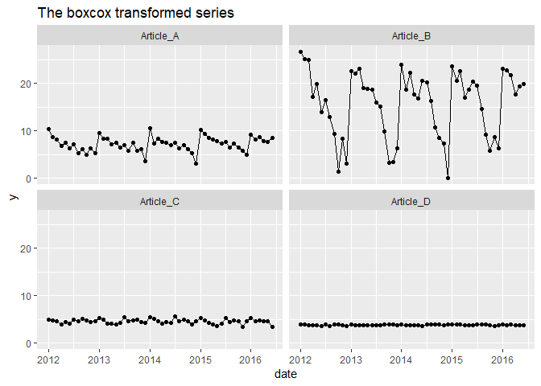

<!-- README.md is generated from README.Rmd. Please edit that file -->

[](https://travis-ci.org/flostracke/efor)
[](https://codecov.io/github/flostracke/tidypreprocess?branch=master)

# tidypreprocess

The goal of tidypreprocess is to make it easier if you have to apply
preprocessing to multiple timesereis

## Installation

You can install the released version of tidypreprocess from github with:

``` r
devtools::install_github("flostracke/tidypreprocess")
```

## Example

First we load some packages for this example.

``` r

library(salesdata) # devtools::install_github("flostracke/salesdata")
library(tidyverse)
#> -- Attaching packages -------------------------------------------------------------------- tidyverse 1.2.1 --
#> v ggplot2 3.0.0     v purrr   0.2.5
#> v tibble  1.4.2     v dplyr   0.7.8
#> v tidyr   0.8.1     v stringr 1.3.1
#> v readr   1.1.1     v forcats 0.3.0
#> -- Conflicts ----------------------------------------------------------------------- tidyverse_conflicts() --
#> x dplyr::filter() masks stats::filter()
#> x dplyr::lag()    masks stats::lag()
library(tidypreprocess)

sales_data <- sales_monthly
```

We have some sales data for four articles. Prior to forecasting to these
series we want to apply the boxcox transformation. This makes the series
normal distributed.

``` r

ggplot(sales_data, aes(x = date, y = y)) +
  geom_line() +
  geom_point() +
  facet_wrap(~iterate) +
  ggtitle("The original series")
```


We retrieve the lambdas for the dataset. With these lambdas we can
revert the boxcox transformation.

``` r
lambdas <- tf_get_lambdas(sales_data)

lambdas
#> # A tibble: 4 x 2
#>   iterate    lambda
#>   <chr>       <dbl>
#> 1 Article_A  0.102 
#> 2 Article_B  0.330 
#> 3 Article_C -0.0575
#> 4 Article_D -0.196
```

Apply the boxcox transformation

``` r

sales_data_trans <- tf_boxcox(sales_data)
```

A quick plot of the transformed data:

``` r
ggplot(sales_data_trans, aes(x = date, y = y)) +
  geom_line() +
  geom_point() +
  facet_wrap(~iterate) +
  ggtitle("The boxcox transformed series")
```



Now we remove the transformation

``` r

sales_data_retransformed <- tf_remove_boxcox(sales_data_trans, lambdas) %>%

  # we round the numbers in order to compare for resulting differences due to the
  # backtransformation
  mutate(y = round(y,0))
```

The transformation and the backtransformation is working

``` r
sales_data %>%
  left_join(
    sales_data_retransformed,
    by = c("date", "iterate"),
    suffix = c("_orig", "_trans")
  ) %>%
  mutate(diff = y_orig - y_trans) %>%
  filter(diff != 0)
#> # A tibble: 0 x 5
#> # ... with 5 variables: date <date>, y_orig <int>, iterate <chr>,
#> #   y_trans <dbl>, diff <dbl>
```
