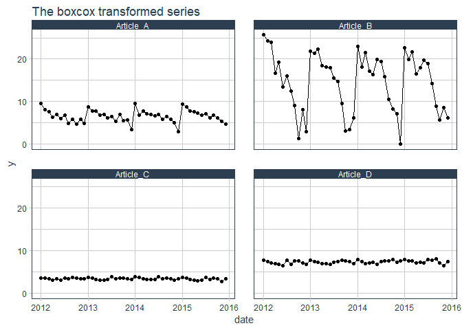

<!-- README.md is generated from README.Rmd. Please edit that file -->

[](https://travis-ci.org/flostracke/efor)
[](https://codecov.io/github/flostracke/efor?branch=master)
[](https://github.com/joethorley/stability-badges#experimental)

# efor

The goal of EasyFORcasting or short efor is to make it easier if you
have to forecast or apply preprocessing to multiple timeseries.
Furthermore the the package supports in transforming timeseries data for
applying machine learning or deeplearning to it. (Creation of lagged
values)

## Installation

You can install the released version of efor from github with:

``` r
#devtools::install_github("flostracke/efor")
```

## Example

First we load some packages for this example.

``` r

library(tidyverse)
library(efor)
library(furrr) # for running the forecasting in parallel
library(forecast) #provides forecast mehotds
library(prophet) # provides forecast mehod
library(tidyquant) # for nicer plots

sales_data <- sales_monthly
```

We have some sales data for four articles. We want to create forecasts
for all these articles. The efor package makes this quite easy, because
it provides functionality to create forecasts for multiple articles with
one line of code. Right now you can use the forecast package or the
prophet package.

The idea is that all the data has to be organised in one dataframe with
the following columns:

  - date: The date: Right now it’s possible to use daily and monthly
    data.
  - iterate: the grouping variable. In this example it is the
    articlenumber
  - y: the value you want to forecast

<!-- end list -->

``` r

ggplot(sales_data, aes(x = date, y = y)) +
  geom_line() +
  geom_point() +
  facet_wrap(~iterate) +
  ggtitle("The original series") +
  theme_tq() 
```


We split the dataset in a train and test set. All observations from the
year 2016 go to the test set. We want to create forecasts for the next 4
months of the testset and evaluate the performance.

``` r
train_data <- sales_data %>% 
  filter(date < "2016-01-01")

test_data <- sales_data %>% 
  filter(date >= "2016-01-01")
```

Now we can apply the the auto.arima function to the dataset and create
the forecasts. All the methods from the forecast package can be run in
parallel.

``` r
forecasts_ar <- tf_grouped_forecasts(
  train_data,        # used training dataset
  n_pred = 4,        # number of predictions
  func = auto.arima, # used forecasting method
  freq = 12,         # Frequency. 12 for monthly data, 1 for daily data,
  parallel = TRUE    # for runiing in parallel
)
```

With the same syntax you can create forecasts utilizing the prophet
package: Please note that there we disable the parallel function for
prophet, because there is some bug right now.

``` r
forecasts_prophet <- tf_grouped_forecasts(
  train_data,      # used training dataset
  n_pred = 4,      # number of predictions
  func = prophet,  # used forecasting method
  freq = 12,       # Frequency. 12 for monthly data, 1 for daily data
  parallel = FALSE #disabling parallel for prohet
)
```

In order to create some plots and evaluate the performance we combine
the forecasts into one dataset.

``` r
forecasts <- bind_rows(forecasts_ar, forecasts_prophet)
```

The package brings also a function which makes ist quite easy to access
the performance (right now thhe mae, rmse and rsquared is calculated)of
multiple methods:

``` r
tf_calc_metrics(forecasts, test_data)
#> # A tibble: 6 x 3
#>   key        metric   value
#>   <chr>      <chr>    <dbl>
#> 1 auto.arima mae    154.   
#> 2 prophet    mae    157.   
#> 3 prophet    rmse   217.   
#> 4 auto.arima rmse   222.   
#> 5 auto.arima rsq      0.847
#> 6 prophet    rsq      0.858
```

Also it is possible to access the performance of each article:

``` r
tf_calc_metrics(forecasts, test_data, detailed = TRUE)
#> # A tibble: 24 x 4
#>    key        iterate   metric value
#>    <chr>      <chr>     <chr>  <dbl>
#>  1 auto.arima Article_B mae     71  
#>  2 prophet    Article_C mae     88.3
#>  3 prophet    Article_B mae     90.0
#>  4 auto.arima Article_C mae    123. 
#>  5 auto.arima Article_A mae    177. 
#>  6 prophet    Article_A mae    212. 
#>  7 prophet    Article_D mae    237. 
#>  8 auto.arima Article_D mae    243. 
#>  9 auto.arima Article_B rmse    86.2
#> 10 prophet    Article_C rmse   102. 
#> # ... with 14 more rows
```

Finally we create a quick graph visualising the results of the
forecasts.

``` r
train_data_plot <- train_data %>% 
  mutate(key = "train")

test_data_plot <- test_data %>% 
  mutate(key = "test")

bind_rows(train_data_plot, test_data_plot) %>% 
  bind_rows(forecasts) %>% 
  ggplot(aes(x = date, y = y, color = key)) +
  geom_point() +
  geom_line() +
  facet_wrap(~iterate) +
  ggtitle("Forecasted values for each article") +
  ylab("Sales amount") +
  theme_tq() 
```


## Other included stuff

There are couple of further things involded in the package, which make
applying techniques to multiple timeseries easier.

### Decomposition

There are functions for splitting timeseries in trend, seasonality and
noise

``` r
tf_decompose(train_data)
#> frequency = 12 months
#> trend = 24 months
#> frequency = 12 months
#> trend = 24 months
#> frequency = 12 months
#> trend = 24 months
#> frequency = 12 months
#> trend = 24 months
#> # A tibble: 192 x 6
#>    date           y iterate   season trend remainder
#>    <date>     <dbl> <chr>      <dbl> <dbl>     <dbl>
#>  1 2012-01-01  1179 Article_A  799.   271.    109.  
#>  2 2012-02-01   516 Article_A  208.   270.     37.8 
#>  3 2012-03-01   381 Article_A  132.   269.    -19.2 
#>  4 2012-04-01   171 Article_A  -15.7  267.    -80.8 
#>  5 2012-05-01   264 Article_A  -15.4  266.     13.0 
#>  6 2012-06-01   135 Article_A -110.   265.    -20.3 
#>  7 2012-07-01   225 Article_A  -44.4  264.      4.93
#>  8 2012-08-01    66 Article_A -183.   264.    -15.0 
#>  9 2012-09-01   123 Article_A -107.   263.    -32.3 
#> 10 2012-10-01    54 Article_A -189.   262.    -18.3 
#> # ... with 182 more rows
```

### Transformations and cleaning

There are a couple of transformations possible (BoxCox, and
forecast::tsclean)

#### BoxCox

First we get the lambda for each timeseries

``` r
lambdas <- tf_get_lambdas(train_data)

lambdas
#> # A tibble: 4 x 2
#>   iterate    lambda
#>   <chr>       <dbl>
#> 1 Article_A  0.0804
#> 2 Article_B  0.322 
#> 3 Article_C -0.182 
#> 4 Article_D  0.0127
```

Apply the BoxCox transformation with the calculated lambdas:

``` r
train_data_boxcox <- tf_boxcox(train_data)
```

Quick plot of the boxcox transformed series:

``` r
ggplot(train_data_boxcox, aes(x = date, y = y)) +
  geom_line() +
  geom_point() +
  facet_wrap(~iterate) +
  ggtitle("The boxcox transformed series") +
  theme_tq()
```



Afterwards it’s possible to remove the boxcox transformation:

``` r
tf_remove_boxcox(train_data_boxcox, lambdas)
#> # A tibble: 192 x 3
#>    date            y iterate  
#>    <date>      <dbl> <chr>    
#>  1 2012-01-01 1179.  Article_A
#>  2 2012-02-01  516.  Article_A
#>  3 2012-03-01  381   Article_A
#>  4 2012-04-01  171.  Article_A
#>  5 2012-05-01  264.  Article_A
#>  6 2012-06-01  135.  Article_A
#>  7 2012-07-01  225.  Article_A
#>  8 2012-08-01   66.0 Article_A
#>  9 2012-09-01  123.  Article_A
#> 10 2012-10-01   54.0 Article_A
#> # ... with 182 more rows
```

  - There are functions for preparing timeseries for regression tasks
  - there is a function for applying a gridsearch for prophet models

## Next Steps

  - add a function for handling outliers via the anomalize package
