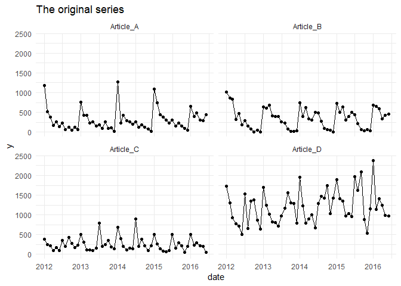

<!-- README.md is generated from README.Rmd. Please edit that file -->

[](https://travis-ci.org/flostracke/efor)
[](https://codecov.io/github/flostracke/efor?branch=master)
[](https://github.com/joethorley/stability-badges#experimental)

# efor

The goal of EasyFORcasting or short efor is to make it easier if you
have to forecast multiple timeseries. The package supports you in
creating forecasts with different methods implemented in the forecast,
forecastHyrid, smooth and prophet package. Furthermore it provides some
functions for evaluating these forecasts.

Following you see a possible workflow:

## Installation

You can install the released version of efor from github with:

``` r
#devtools::install_github("flostracke/efor")
```

## Example

### Setup

First we load some packages for this example. The efor package contains
some fictional timeseries data for demonstrating the apporaches:

``` r

library(tidyverse)
library(tsibble) # for creating nicer representation of monthly data
library(efor)
library(furrr) # for running the forecasting in parallel
library(forecast) #provides forecast mehotds
library(prophet) # provides forecast mehod


sales_data <- sales_monthly %>% 
  mutate(date = yearmonth(date))

sales_data
#> # A tibble: 216 x 3
#>        date     y iterate  
#>       <mth> <dbl> <chr>    
#>  1 2012 Jan  1179 Article_A
#>  2 2012 Feb   516 Article_A
#>  3 2012 Mrz   381 Article_A
#>  4 2012 Apr   171 Article_A
#>  5 2012 Mai   264 Article_A
#>  6 2012 Jun   135 Article_A
#>  7 2012 Jul   225 Article_A
#>  8 2012 Aug    66 Article_A
#>  9 2012 Sep   123 Article_A
#> 10 2012 Okt    54 Article_A
#> # ... with 206 more rows
```

We have some sales data for four articles. We want to create forecasts
for all these articles. The efor package makes this quite easy, because
it provides functionality to create forecasts for multiple articles with
just one function call

The idea is that all the data has to be organised in one dataframe with
the following columns:

  - date: A date column
  - iterate: the grouping variable. In this example it is the
    articlenumber
  - y: the value you want to forecast

The dataframe sales\_data is already meeting these requirements.

Before we start forecasts let’s quickly create a plot of the data:

``` r

ggplot(sales_data, aes(x = date, y = y)) +
  geom_line() +
  geom_point() +
  facet_wrap(~iterate) +
  ggtitle("The original series") +
  theme_minimal() 
```



We split the dataset in a train and test set. All observations from the
year 2016 go into the test set. We want to create forecasts for the next
4 months of the testset and evaluate the performance of different
methods.

``` r
train_data <- sales_data %>% 
  filter(date < "2016-01-01")

test_data <- sales_data %>% 
  filter(date >= "2016-01-01")
```

Now we can apply the the auto.arima function to the dataset and create
the forecasts. All the methods from the forecast package can be run in
parallel.

### Model Fitting

``` r
forecasts_ar <- tf_grouped_forecasts(
  train_data,        # used training dataset
  n_pred = 6,        # number of predictions
  func = auto.arima, # used forecasting method
  parallel = TRUE    # for runiing in parallel
)

forecasts_ar
#> # A tibble: 24 x 6
#>        date iterate   key            y y_lo_95 y_hi_95
#>       <mth> <chr>     <chr>      <dbl>   <dbl>   <dbl>
#>  1 2016 Jan Article_A auto.arima 1266.  1051.    1481.
#>  2 2016 Feb Article_A auto.arima  425.   210.     640.
#>  3 2016 Mrz Article_A auto.arima  476.   260.     691.
#>  4 2016 Apr Article_A auto.arima  367.   152.     582.
#>  5 2016 Mai Article_A auto.arima  319.   103.     534.
#>  6 2016 Jun Article_A auto.arima  255.    39.8    470.
#>  7 2016 Jan Article_B auto.arima  723    500.     946.
#>  8 2016 Feb Article_B auto.arima  501    278.     724.
#>  9 2016 Mrz Article_B auto.arima  642    419.     865.
#> 10 2016 Apr Article_B auto.arima  306     83.0    529.
#> # ... with 14 more rows
```

With the same syntax you can create forecasts utilizing the prophet
package: Please note that there we disable the parallel function for
prophet, because there is some bug right now.

``` r
forecasts_prophet <- tf_grouped_forecasts(
  train_data,      # used training dataset
  n_pred = 6,      # number of predictions
  func = prophet,  # used forecasting method
  parallel = FALSE #disabling parallel for prohet
)

forecasts_prophet
#> # A tibble: 24 x 6
#>        date iterate   key         y y_lo_95 y_hi_95
#>       <mth> <chr>     <chr>   <dbl>   <dbl>   <dbl>
#>  1 2016 Jan Article_A prophet 1224.   1092.   1367.
#>  2 2016 Feb Article_A prophet  589.    450.    723.
#>  3 2016 Mrz Article_A prophet  545.    407.    694.
#>  4 2016 Apr Article_A prophet  334.    190.    474.
#>  5 2016 Mai Article_A prophet  384.    252.    520.
#>  6 2016 Jun Article_A prophet  258.    127.    403.
#>  7 2016 Jan Article_B prophet  835.    699.    972.
#>  8 2016 Feb Article_B prophet  635.    489.    768.
#>  9 2016 Mrz Article_B prophet  759.    614.    893.
#> 10 2016 Apr Article_B prophet  355.    213.    488.
#> # ... with 14 more rows
```

### Evaluation

In order to create some plots and evaluate the performance we combine
the forecasts into one dataset.

``` r
forecasts <- bind_rows(forecasts_ar, forecasts_prophet) %>% 
  mutate(date = yearmonth(date)) #reformat the date because of a bug in bind_rows
```

The package brings also a function which makes ist quite easy to access
the performance (right now thhe mae, rmse and rsquared is calculated)of
multiple methods:

``` r
tf_calc_metrics(forecasts, test_data)
#> # A tibble: 10 x 3
#>    key        metric   value
#>    <chr>      <chr>    <dbl>
#>  1 auto.arima mae    129.   
#>  2 prophet    mae    135.   
#>  3 prophet    rmse   188.   
#>  4 auto.arima rmse   192.   
#>  5 auto.arima rsq      0.865
#>  6 prophet    rsq      0.869
#>  7 auto.arima mase     0.469
#>  8 prophet    mase     0.491
#>  9 auto.arima mape    25.4  
#> 10 prophet    mape    31.4
```

Also it is possible to access the performance of each article:

``` r
tf_calc_metrics(forecasts, test_data, detailed = TRUE)
#> # A tibble: 40 x 4
#>    key        metric value iterate  
#>    <chr>      <chr>  <dbl> <chr>    
#>  1 auto.arima mae     60   Article_B
#>  2 prophet    mae     83.8 Article_C
#>  3 prophet    mae     84.5 Article_B
#>  4 auto.arima mae    115.  Article_C
#>  5 auto.arima mae    154.  Article_A
#>  6 prophet    mae    186.  Article_D
#>  7 prophet    mae    187.  Article_A
#>  8 auto.arima mae    189.  Article_D
#>  9 auto.arima rmse    73.8 Article_B
#> 10 prophet    rmse    94.0 Article_C
#> # ... with 30 more rows
```

Finally we create a quick graph visualising the results of the
forecasts.

``` r
train_data_plot <- train_data %>% 
  mutate(key = "train")

test_data_plot <- test_data %>% 
  mutate(key = "test")

bind_rows(train_data_plot, test_data_plot) %>% 
  bind_rows(forecasts) %>% 
  filter(key %in% c("auto.arima", "train", "test")) %>% 
  mutate(date = yearmonth(date)) %>% 
  ggplot(aes(x = date, y = y, color = key)) +
  geom_point() +
  geom_line() +
  facet_wrap(~iterate) +
  ggtitle("Forecasted values for each article") +
  ylab("Sales amount") +
  theme_minimal()
```


